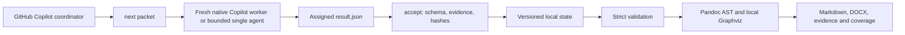

# Architecture and contracts

## Runtime boundary

The shipped folder is self-contained. `docgen.py` dispatches JSON-emitting commands; `pipeline/` implements deterministic inventory, state/validation, and local rendering. `tasks/` contains versioned Copilot instructions; `schemas/result.schema.json` uses JSON Schema 2020-12 with closed objects. `templates/reference.docx` has a reproducible builder. `setup.py` is the only dependency-installation path and must be explicitly invoked. No runtime module contains a network/model client or launches an agent/model subprocess.

This explanatory repository diagram is not a runtime renderer. Client diagrams use only Graphviz.

## CLI and files

Use the selected Python, `docgen.py --root REPOSITORY [--scope PATH ...] COMMAND`. Scope/root options precede the command. Commands emit JSON, not source dumps. Exit codes: 0 success; 2 configuration/schema/path/contract error; 3 dependency/process failure; 4 coordinator/ownership conflict; 5 stale source/toolkit state; 6 incomplete/blocked quality gate or budget. Argparse usage errors also return 2.

| Command | Purpose |
|---|---|
| `doctor` | Python and executable versions/paths, actionable optional/required failures |
| `prepare` / `rescan` | Inventory snapshot, recover/validate caches, recompute active DAG; returns session token |
| `next --session TOKEN` | Issue/reissue one bounded task; return packet/result path only |
| `accept --session TOKEN --task ID` | Validate fixed assigned result path, checkpoint accepted copy and digest |
| `status` | Explicit coverage/task/QA counters and paths |
| `lookup QUERY [--task ID --session TOKEN]` | Bounded ID discovery; optionally attach records and sources to the packet |
| `evidence --task ID --session TOKEN --path P --start N --end M` | Register additional redacted ranges, including evidence external to scope |
| `repair --task AFFECTED_ID --session TOKEN` | Reissue one accepted analysis/reconciliation/authoring task tied to review findings; cap cycles |
| `validate` | Mechanical contracts, hashes, range/index/review accounting and required work |
| `export [--partial]` | Local assembly only; no model requests |
| `preview` | Isolated LibreOffice conversion and local PDF page rasterization |
| `record-layout --pages 1,2,... --reviewer copilot --notes TEXT` | Record actual page-image inspection, tied to the preview's DOCX hash; never assigns human approval |
| `recover-lock` | Recover a command lock after its PID has exited |

`.docgen/runs/<scope-id>/state.json` is the single atomic checkpoint. `manifest.json` records inventory and source snapshot. `tasks/<id>/packet.json`, worker `result.json`, immutable `accepted.json`, and prior repair revisions keep authoring separate from presentation. `validation.json` records gates. A worker never writes state. A scoped exclusive filesystem lock protects commands; an explicit coordinator token protects the chat workflow across commands. Only a stopped coordinator can be recovered. PID reuse can conservatively block lock recovery; inspect the process before moving a stale lock manually.

Atomic writes use a same-directory temporary file, flush/fsync, then replace. An interruption before state commit leaves an unaccepted artifact; `next` reissues the same task for validation. `.writing-*.tmp` and failed `.building-*` directories are diagnostic orphans and are never accepted by existence alone. No automatic destructive cleanup occurs. If an accepted artifact hash/schema changes, prepare requeues it. Concurrent agents sharing a token are unsupported; the skill uses sequential workers.

`accept` checkpoints a review before attempting an incremental Word export, under the same coordinator lock. All active section tasks for a subsystem must be accepted, all required review shards must cover its prose/diagrams without blockers, and ownership/source-range accounting must be complete. The shared saved-artifact integrity gate rechecks schemas, dependency hashes and the source snapshot; assembly rechecks Markdown and renders only selected chapters' diagrams. Pending/unreviewed synthesis and chapters never enter this draft. The progress page derives statuses from the active DAG rather than model-written completion fields.

Progress rendering uses a new staging directory and the same DOCX finishing/image/link checks as final export. After rendering and a second freshness check, the engine retains the completed `progress-build-*` directory and atomically replaces the stable `documentation-progress.docx`. A render/validation/replacement failure preserves the last successful document and acceptance checkpoint, reports `progress_error`, and is retried by `next` without model work. A fingerprint of selected artifacts, statuses, snapshot, presentation and configuration avoids rebuilding an unchanged preview. `state.progress_preview` records the successful path/hash and whether it remains current; `state.build` and all strict final-export gates are separate. If invalidation leaves no completed chapter, the previous snapshot's draft remains available with `current: false` until a new chapter qualifies.

## Inventory and budgets

Git enumeration uses NUL-delimited tracked stage records and eligible untracked files; tracked ignored source remains a candidate, while toolkit/dependency/credential exclusions still apply. Dirty Git metadata is recorded separately from file hashes and HEAD. Submodule working content is not traversed/fetched; unavailable content and LFS pointers are explicit gaps. UTF-8 (including BOM) is supported; decode errors are recorded, never swallowed. Links/reparse points are not followed, even within the root. Generated-header detection is a heuristic recorded as such.

Without a Git repository root, a deterministic sorted walk applies nested `.gitignore` and `.docgenignore`: `*`, `?`, character classes and `!` rules using Python fnmatch; slash-containing patterns are directory-relative, basename patterns match path components. This is a documented subset, not Git's full ignore language: no escaped trailing spaces, special `**` boundary semantics, global Git excludes or re-inclusion underneath pruned directories. In Git mode, native Git ignore semantics govern untracked files; `docgen.toml` exclusions apply in both modes. Large excluded trees receive directory records, not invented per-file inspection counts.

Packets preserve original path/hash/line range and a chunk ID. Splits prefer nearby blank boundaries, otherwise bounded lines; union accounting independently checks every eligible line and every empty-file sentinel. A line too large to fit remains an explicit unprocessed gap. No generic parser is presented as a universal call graph. Literal masking preserves line correspondence, but can both redact harmless text and miss secrets.

Default source estimate ceiling is 8,000 tokens; the total input packet ceiling is 12,000, output ceiling 6,000, summary ceiling 800. UTF-8 bytes/3 estimates are conservative approximations, not actual tokenization or model context knowledge. The engine reserves room for task instructions/schema overhead, dependency material and minimum per-chunk output. Effective source size is often below the nominal ceiling. All reconciliation, writing, review and synthesis use bounded groups. A single oversized unit fails explicitly; budgets may be adjusted within strict limits. The engine never truncates content and claims full coverage.

## Task graph, reconciliation and reuse

Source packet discovery produces provisional ownership proposals; analysis extracts facts. Once extraction is accepted, reconciliation shards own each eligible file once (large files can have many packets). Each shard has bounded lookup access to related accepted facts and prior ownership decisions. Meaningful relationships are typed, not inferred from imports automatically. Entry facts get mapped or unresolved rows. Final writing groups facts by reconciled subsystem and source volume; review tasks are further bounded by block/diagram and their original evidence. The overview uses a shrinking tree of summaries retaining evidence IDs; root synthesis is separately reviewed.

Cache keys include source/chunk data, accepted dependency artifact hashes, scope/semantic config, schema/task/skill/engine versions. File changes, additions, deletions and renames alter packet inputs. Unchanged source packet tasks can be reused; any analysis change conservatively invalidates **all** reconciliation and downstream content because a generic tool cannot precisely prove shared/dynamic dependency impact. Targeted evidence is hash-checked too. Formatting/style changes do not change extraction keys; accepted facts rebuild without a model. Title/branding affect presentation, language/audience affect authoring. Accepted artifacts are revalidated before reuse; no model status flag is authoritative.

The same source and accepted artifacts yield the same content with pinned tooling. New model runs can change decisions and wording. Tool/platform/font versions, Word rendering, document metadata and ZIP timestamps may differ; byte-identical AI output or cross-machine DOCX archives are not promised.

## Structured authoring and semantic boundaries

The schema defines source references, facts, typed relations, ownership, sections/blocks, diagrams and review findings. IDs use a task namespace, preventing accidental collisions. Observed/inferred facts require evidence; unknown facts require a concrete explanation and `not-established` basis. Basis also distinguishes implementation, declaration, documentation and test expectation. Conflict links are explicit. Optional exact snippets match the whole redacted source range; a `symbol` label has no automatic semantic authority without a trustworthy parser.

Each prose block declares fact IDs and includes `[source](fact:ID)` markers in every substantive paragraph/list item and every factual table row. Pandoc parses structure; checks never rewrite headings/code with broad regex replacements. Only fact and internal links are permitted in model Markdown. Images/raw markup/manual footnotes are refused; diagrams come from validated specifications. Assembly converts source markers to unobtrusive evidence links and verifies both AST targets and actual DOCX bookmark/hyperlink pairs. Word contents are visible clickable entries without invented page numbers, not a field waiting for viewer updates.

Reviews are Copilot judgments against underlying source and facts. Every block/diagram gets an explicit review record; fresh-context provenance is declared honestly, with same-context fallback counted separately. Structural checks do not establish entailment. Blockers prevent strict export; honestly documented external runtime unknowns need not. Automated author repair defaults to two cycles. Human approval is never assigned by scripts or Copilot.

The engine constrains paths and allowed artifacts, but skill prose does not sandbox Copilot's general editor tools. Embedded source/model instructions are untrusted data. The repository owner must still use Copilot approvals and organizational policy.

## Rendering and extension points

Diagram node/edge content is schema-validated and escaped into fixed DOT styling. Endpoints/facts/relations must exist. SVG and 200-DPI PNG are local; effective text size must remain at least 9pt at the actual A4 content width/height. Excess complexity blocks export. Numbered ordered-flow diagrams plus interaction tables cover temporal explanations without another renderer. Geometry is mechanical, not visual judgment.

The bundled reference and builder use A4, 20mm margins, 11pt body text, navy/teal headings, table header repetition, code/path styles and page footers. OOXML finishing adds chapter page breaks and wrapping opportunities. Preview isolates LibreOffice profiles/temp directories; local assets/fonts only. No human-approved status is available.

To extend a fact/relation type, update the schema builder, generated schema, worker contracts and rejection/acceptance tests together; version changes invalidate affected caches. Add narrowly scoped static parsers only when their symbol/range claims can be tested; retain generic text fallback. Add a renderer only with a tested local use case and equivalent confidentiality/geometry gates. Keep extensions inside the skill folder, add them to the ownership manifest through packaging, and do not introduce agent frameworks, services or external model clients.
