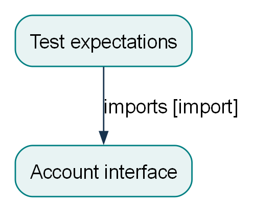

::: {custom-style="Title"}
Hand-authored fixture --- maintenance style sample
:::

Technical maintenance documentation

Source-based analysis · developer maintenance

Snapshot: 0052a12dae50179afd966c893556492f64f00c56062b570a6f5fc375854d88d3

Scope: .

Snapshot kind: non-Git directory. File hashes identify the source material read for this document.

# Contents

[1 System overview](#system-overview)

[    1.1 Fixture purpose and constraints](#sy-64f6ed05ac15d38ea38d.s1)

[2 Ledger](#subsystem-ledger)

[    2.1 Maintenance context](#wr-8125777818bda6ba96d8.s1)

[    2.2 Component index](#index-ledger)

[3 Knowledge gaps and coverage](#coverage)

[4 Evidence references](#evidence-references)

# 1 System overview

## 1.1 Fixture purpose and constraints {#sy-64f6ed05ac15d38ea38d.s1}

The README identifies hand-authored synthetic fixture material and describes documentation intent; it is not proof of executed behavior. [\[1\]](#an-0251d63ddffdd14171ce.f1)

Account.debit(amount: int) returns the remaining integer balance; it raises ValueError before mutation for non-positive amounts or insufficient balance. [\[2\]](#an-0251d63ddffdd14171ce.f2)

  Subsystem     Indexed components   Unresolved ownership
  ----------- -------------------- ----------------------
  ledger                         4                      0

# 2 Ledger {#subsystem-ledger}

## 2.1 Maintenance context {#wr-8125777818bda6ba96d8.s1}

### 2.1.1 Where it fits {#wr-8125777818bda6ba96d8.context-where-it-fits}

The fixture library owns the balance mutation boundary. [\[2\]](#an-0251d63ddffdd14171ce.f2)

### 2.1.2 Inputs {#wr-8125777818bda6ba96d8.context-inputs}

  ----------------------------------------------------------------------------------------------------------
  Input          Type / Shape       Source         When               Evidence
  -------------- ------------------ -------------- ------------------ --------------------------------------
  amount         positive integer   caller         debit invocation   [\[2\]](#an-0251d63ddffdd14171ce.f2)

  ----------------------------------------------------------------------------------------------------------

### 2.1.3 Outputs {#wr-8125777818bda6ba96d8.context-outputs}

  -------------------------------------------------------------------------------------------------------------------------
  Output              Type / Shape   Destination    When                             Evidence
  ------------------- -------------- -------------- -------------------------------- --------------------------------------
  remaining balance   integer        caller         accepted debit                   [\[2\]](#an-0251d63ddffdd14171ce.f2)

  ValueError          exception      caller         invalid or insufficient amount   [\[2\]](#an-0251d63ddffdd14171ce.f2)
  -------------------------------------------------------------------------------------------------------------------------

The README identifies hand-authored synthetic fixture material and describes documentation intent; it is not proof of executed behavior. [\[1\]](#an-0251d63ddffdd14171ce.f1)

Account.debit(amount: int) returns the remaining integer balance; it raises ValueError before mutation for non-positive amounts or insufficient balance. [\[2\]](#an-0251d63ddffdd14171ce.f2)

The fixture declares Python \>=3.11 and pytest discovery under tests. [\[3\]](#an-0251d63ddffdd14171ce.f3)

The test expects an insufficient withdrawal to raise ValueError and preserve balance 10. This test was read, not run. [\[4\]](#an-0251d63ddffdd14171ce.f4)

### 2.1.4 Interface details {#wr-8125777818bda6ba96d8.layout-interface-details}

The following layout fixture repeats a supported interface row to exercise multi-page tables; it is not additional application functionality. [\[2\]](#an-0251d63ddffdd14171ce.f2)

  ------------------------------------------------------------------------------------------------------------------
  Case                    Interface / path        Expected source behavior
  ----------------------- ----------------------- ------------------------------------------------------------------
  Layout row 01           `Account.debit`         Reject non-positive amount. [\[2\]](#an-0251d63ddffdd14171ce.f2)

  Layout row 02           `Account.debit`         Reject non-positive amount. [\[2\]](#an-0251d63ddffdd14171ce.f2)

  Layout row 03           `Account.debit`         Reject non-positive amount. [\[2\]](#an-0251d63ddffdd14171ce.f2)

  Layout row 04           `Account.debit`         Reject non-positive amount. [\[2\]](#an-0251d63ddffdd14171ce.f2)

  Layout row 05           `Account.debit`         Reject non-positive amount. [\[2\]](#an-0251d63ddffdd14171ce.f2)

  Layout row 06           `Account.debit`         Reject non-positive amount. [\[2\]](#an-0251d63ddffdd14171ce.f2)

  Layout row 07           `Account.debit`         Reject non-positive amount. [\[2\]](#an-0251d63ddffdd14171ce.f2)

  Layout row 08           `Account.debit`         Reject non-positive amount. [\[2\]](#an-0251d63ddffdd14171ce.f2)

  Layout row 09           `Account.debit`         Reject non-positive amount. [\[2\]](#an-0251d63ddffdd14171ce.f2)

  Layout row 10           `Account.debit`         Reject non-positive amount. [\[2\]](#an-0251d63ddffdd14171ce.f2)

  Layout row 11           `Account.debit`         Reject non-positive amount. [\[2\]](#an-0251d63ddffdd14171ce.f2)

  Layout row 12           `Account.debit`         Reject non-positive amount. [\[2\]](#an-0251d63ddffdd14171ce.f2)

  Layout row 13           `Account.debit`         Reject non-positive amount. [\[2\]](#an-0251d63ddffdd14171ce.f2)

  Layout row 14           `Account.debit`         Reject non-positive amount. [\[2\]](#an-0251d63ddffdd14171ce.f2)

  Layout row 15           `Account.debit`         Reject non-positive amount. [\[2\]](#an-0251d63ddffdd14171ce.f2)

  Layout row 16           `Account.debit`         Reject non-positive amount. [\[2\]](#an-0251d63ddffdd14171ce.f2)

  Layout row 17           `Account.debit`         Reject non-positive amount. [\[2\]](#an-0251d63ddffdd14171ce.f2)

  Layout row 18           `Account.debit`         Reject non-positive amount. [\[2\]](#an-0251d63ddffdd14171ce.f2)

  Layout row 19           `Account.debit`         Reject non-positive amount. [\[2\]](#an-0251d63ddffdd14171ce.f2)

  Layout row 20           `Account.debit`         Reject non-positive amount. [\[2\]](#an-0251d63ddffdd14171ce.f2)

  Layout row 21           `Account.debit`         Reject non-positive amount. [\[2\]](#an-0251d63ddffdd14171ce.f2)

  Layout row 22           `Account.debit`         Reject non-positive amount. [\[2\]](#an-0251d63ddffdd14171ce.f2)

  Layout row 23           `Account.debit`         Reject non-positive amount. [\[2\]](#an-0251d63ddffdd14171ce.f2)

  Layout row 24           `Account.debit`         Reject non-positive amount. [\[2\]](#an-0251d63ddffdd14171ce.f2)

  Layout row 25           `Account.debit`         Reject non-positive amount. [\[2\]](#an-0251d63ddffdd14171ce.f2)

  Layout row 26           `Account.debit`         Reject non-positive amount. [\[2\]](#an-0251d63ddffdd14171ce.f2)

  Layout row 27           `Account.debit`         Reject non-positive amount. [\[2\]](#an-0251d63ddffdd14171ce.f2)

  Layout row 28           `Account.debit`         Reject non-positive amount. [\[2\]](#an-0251d63ddffdd14171ce.f2)

  Layout row 29           `Account.debit`         Reject non-positive amount. [\[2\]](#an-0251d63ddffdd14171ce.f2)

  Layout row 30           `Account.debit`         Reject non-positive amount. [\[2\]](#an-0251d63ddffdd14171ce.f2)

  Layout row 31           `Account.debit`         Reject non-positive amount. [\[2\]](#an-0251d63ddffdd14171ce.f2)

  Layout row 32           `Account.debit`         Reject non-positive amount. [\[2\]](#an-0251d63ddffdd14171ce.f2)

  Layout row 33           `Account.debit`         Reject non-positive amount. [\[2\]](#an-0251d63ddffdd14171ce.f2)

  Layout row 34           `Account.debit`         Reject non-positive amount. [\[2\]](#an-0251d63ddffdd14171ce.f2)

  Layout row 35           `Account.debit`         Reject non-positive amount. [\[2\]](#an-0251d63ddffdd14171ce.f2)

  Layout row 36           `Account.debit`         Reject non-positive amount. [\[2\]](#an-0251d63ddffdd14171ce.f2)

  Layout row 37           `Account.debit`         Reject non-positive amount. [\[2\]](#an-0251d63ddffdd14171ce.f2)

  Layout row 38           `Account.debit`         Reject non-positive amount. [\[2\]](#an-0251d63ddffdd14171ce.f2)

  Layout row 39           `Account.debit`         Reject non-positive amount. [\[2\]](#an-0251d63ddffdd14171ce.f2)

  Layout row 40           `Account.debit`         Reject non-positive amount. [\[2\]](#an-0251d63ddffdd14171ce.f2)

  Layout row 41           `Account.debit`         Reject non-positive amount. [\[2\]](#an-0251d63ddffdd14171ce.f2)

  Layout row 42           `Account.debit`         Reject non-positive amount. [\[2\]](#an-0251d63ddffdd14171ce.f2)

  Layout row 43           `Account.debit`         Reject non-positive amount. [\[2\]](#an-0251d63ddffdd14171ce.f2)

  Layout row 44           `Account.debit`         Reject non-positive amount. [\[2\]](#an-0251d63ddffdd14171ce.f2)

  Layout row 45           `Account.debit`         Reject non-positive amount. [\[2\]](#an-0251d63ddffdd14171ce.f2)

  Layout row 46           `Account.debit`         Reject non-positive amount. [\[2\]](#an-0251d63ddffdd14171ce.f2)

  Layout row 47           `Account.debit`         Reject non-positive amount. [\[2\]](#an-0251d63ddffdd14171ce.f2)

  Layout row 48           `Account.debit`         Reject non-positive amount. [\[2\]](#an-0251d63ddffdd14171ce.f2)

  Layout row 49           `Account.debit`         Reject non-positive amount. [\[2\]](#an-0251d63ddffdd14171ce.f2)

  Layout row 50           `Account.debit`         Reject non-positive amount. [\[2\]](#an-0251d63ddffdd14171ce.f2)

  Layout row 51           `Account.debit`         Reject non-positive amount. [\[2\]](#an-0251d63ddffdd14171ce.f2)

  Layout row 52           `Account.debit`         Reject non-positive amount. [\[2\]](#an-0251d63ddffdd14171ce.f2)

  Layout row 53           `Account.debit`         Reject non-positive amount. [\[2\]](#an-0251d63ddffdd14171ce.f2)

  Layout row 54           `Account.debit`         Reject non-positive amount. [\[2\]](#an-0251d63ddffdd14171ce.f2)

  Layout row 55           `Account.debit`         Reject non-positive amount. [\[2\]](#an-0251d63ddffdd14171ce.f2)
  ------------------------------------------------------------------------------------------------------------------

### 2.1.5 Interface details {#wr-8125777818bda6ba96d8.unicode-interface-details}

Layout sample typography: résumé, Київ, Δstate, → output. Long path example: `samples/very_long_repository_component_name/maintenance_contracts/repeated_interface_example.py`. This sentence is fixture presentation data alongside the supported debit signature. [\[2\]](#an-0251d63ddffdd14171ce.f2)

``` python
def debit(self, amount: int) -> int:
    # Source interface; do not execute during documentation.
    ...
```

{#wr-8125777818bda6ba96d8.d1 width="2.472in"}

::: {custom-style="Caption"}
Figure 1. The test source imports the account implementation; an import does not prove a runtime execution. Solid edges: observed in source; dashed: inferred/unknown. Geometry checked; visual review is separate.
:::

## 2.2 Component index {#index-ledger}

  ----------------------------------------------------------------------------------------------------------------------------------------------------------
  Component                           Responsibility / ownership
  ----------------------------------- ----------------------------------------------------------------------------------------------------------------------
  `README.md`                         Primary placement supported by the fixture's explicit source responsibilities. [Source](#an-0251d63ddffdd14171ce.f1)

  `ledger.py`                         Primary placement supported by the fixture's explicit source responsibilities. [Source](#an-0251d63ddffdd14171ce.f2)

  `pyproject.toml`                    Primary placement supported by the fixture's explicit source responsibilities. [Source](#an-0251d63ddffdd14171ce.f3)

  `tests/test_ledger.py`              Primary placement supported by the fixture's explicit source responsibilities. [Source](#an-0251d63ddffdd14171ce.f4)
  ----------------------------------------------------------------------------------------------------------------------------------------------------------

# 3 Knowledge gaps and coverage {#coverage}

Accepted analysis packets: 1 / 1.

Indexed files: 4 / 4.

Semantically reviewed: 10 / 10.

Eligible lines with accepted analysis: 38 / 38. Redacted lines: 0. Unresolved ownership: 0.

Delivered/accepted ranges do not prove understanding of every line.

Citations and matching hashes do not establish semantic entailment.

Semantic review is a Copilot judgment, not an automated proof.

Redaction is heuristic and can miss secrets; review repository sensitivity first.

Tests were read as source; target code was never run by this toolkit.

Human approval is never assigned by the engine.

Review limitation: Hand-authored fixture review record for deterministic testing. No live Copilot semantic review occurred.

Review context records: 0 fresh; 2 same-context. Context provenance is reported, not independently proven by scripts.

Visual QA is recorded after export in preview/preview.json when pages are rendered and inspected; if absent, it is pending. Human approval: not assigned. See coverage.json for full denominators and review context provenance.

  ----------------------------------------------------------------------------------------------
  Excluded / unavailable material           Reason
  ----------------------------------------- ----------------------------------------------------
  `.docgen`                                 toolkit or generated artifacts; excluded-directory

  `.github/skills/generate-documentation`   toolkit or generated artifacts; excluded-directory

  `docgen.toml`                             toolkit configuration; excluded

  `docs/generated`                          toolkit or generated artifacts; excluded-directory
  ----------------------------------------------------------------------------------------------

# 4 Evidence references

::: {#an-0251d63ddffdd14171ce.f1 custom-style="Source Note"}
\[1\] an-0251d63ddffdd14171ce.f1 · observed · documentation · README.md:1-6
:::

::: {#an-0251d63ddffdd14171ce.f2 custom-style="Source Note"}
\[2\] an-0251d63ddffdd14171ce.f2 · observed · implementation · ledger.py:1-15
:::

::: {#an-0251d63ddffdd14171ce.f3 custom-style="Source Note"}
\[3\] an-0251d63ddffdd14171ce.f3 · observed · declaration · pyproject.toml:1-7
:::

::: {#an-0251d63ddffdd14171ce.f4 custom-style="Source Note"}
\[4\] an-0251d63ddffdd14171ce.f4 · observed · test-expectation · tests/test_ledger.py:1-10
:::
